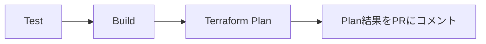
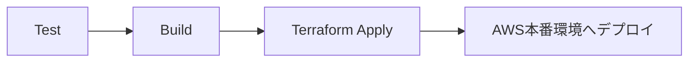

# Local Gateway - Lambda Authorizer PoC

JWTベース認証における「認可判断をDynamoDBで外出しする設計」のPoC実装です。

## アーキテクチャ

```
クライアント → API Gateway (REST) → Lambda Authorizer (TOKEN) → DynamoDB
                                              ↓
                                         Allow/Deny判定
```

## 要件

- **認可フロー**: API Gateway (REST API) → Lambda Authorizer (TOKEN) → DynamoDB
- **データストア**: DynamoDB（認可情報の保存）
- **Lambda**: Go言語で実装、provided.al2023 + bootstrap方式
- **環境**: LocalStack（AWS代替）
- **GUI**: dynamodb-adminでデータ編集可能
- **当PoCではJWTトークンの検証は省略してます**

## セットアップ

### 1. 環境変数の設定

`.env`ファイルを作成：

```bash
cp .env.example .env
```

### 2. Lambda関数のビルド

**重要**: `docker compose up`の前に必ずビルドを実行してください。

```bash
make build
```

これにより`lambda/`配下の各Lambda関数ディレクトリに`function.zip`が生成されます：
- `lambda/authz-go/function.zip` - Lambda Authorizer関数
- `lambda/test-function/function.zip` - テスト用Lambda関数（オプション）

**注意**: `lambda/`配下の各ディレクトリは独立したLambda関数として扱われます。`make build`は`lambda/`配下のすべてのディレクトリを検出してビルドします。

### 3. 環境の起動

```bash
docker compose up -d
  or
docker compose up
```

これにより以下が自動実行されます：
1. LocalStackの起動
2. DynamoDBテーブル（`AllowedTokens`）の作成
3. 初期データの投入（トークン: `allow`）
4. Lambda関数のデプロイ（`lambda/`配下の各`function.zip`が必要）
   - `authz-go`: Lambda Authorizer関数
   - `test-function`: テスト用Lambda関数（存在する場合）
5. API Gatewayの作成とAuthorizer設定

**注意**: 
- 初回起動時や`function.zip`が存在しない場合は、`make build`を実行してから`docker compose up -d`を実行してください
- `lambda/`配下の各ディレクトリに`function.zip`が存在する場合、すべての関数がデプロイされます
- 既にコンテナが起動している場合は、`make deploy`を実行することでビルドとデプロイを一括で実行できます

### 4. 動作確認

#### デプロイ状況の確認

```bash
# コンテナの状態を確認
docker compose ps

# awscliコンテナのログを確認（エラーがある場合）
docker compose logs awscli
```

#### API Gatewayへのリクエストテスト

**注意**: 現在の実装では、AWS_PROXY統合によりtest-function Lambda関数をバックエンドとして呼び出しています。
LocalStackの制限により、Lambda AuthorizerがDenyを返した場合でも、バックエンド（test-function）が呼び出され、ステータスコード200が返される場合があります。
実際のAWS環境では、AuthorizerがDenyを返すと403 Forbiddenが返され、バックエンドは呼び出されませんが、LocalStackでは動作検証の制限として、この動作が正しく実装されていない場合があります。
Authorizerの動作を確認する場合は、以降に掲載される「Lambda関数の個別テスト」で実際の挙動を確認してください。

詳細は[API Gateway統合設定の理解](./doc/api_gateway_integration.md)を参照してください。


もしAPI Gatewayが見つからない場合は、手動でデプロイを実行してください：

```bash
make deploy
```

#### API Gatewayへのcurlリクエスト実行（引数指定可能）

`exec-curl`コマンドを使用すると、引数で柔軟にAPI Gatewayエンドポイントを実行できます。

```bash
make exec-curl [TOKEN=<token>] [METHOD=<method>] [API_PATH=<path>]
```

**注意**: 
- ポート番号は`.env`ファイルの`LOCALSTACK_PORT`が使用されます（デフォルト: 4566）
- API GatewayのIDは自動取得されます（`local-gateway-api`を検索）

**引数説明**:
- `TOKEN`: Authorizationヘッダーに設定するトークン（オプション）
- `METHOD`: HTTPメソッド（デフォルト: GET）
- `API_PATH`: リクエストパス（デフォルト: /test/test）

**例**:
```bash
# デフォルト設定で実行（トークンなし）
make exec-curl

# 有効なトークンで実行
make exec-curl TOKEN=allow

# すべての引数を指定
make exec-curl TOKEN=allow METHOD=GET API_PATH=/test/test
```

#### エンドポイント形式でAPI Gatewayの検証

- API_IDを事前に取得

```bash
make get-api-id
==> getting API Gateway ID
Checking if containers are running...
API ID: xyzabc
```

```bash
curl -H 'Authorization: Bearer allow' http://${API_ID}.execute-api.localhost.localstack.cloud:4666/test/test
```

${API_ID}を事前取得したAPI_IDに置き換えてください。
またはターミナルで一時的に環境変数に登録してもよき。

#### Lambda関数の個別実行

Lambda関数を個別に動作確認できます。
```bash
make exec-lambda LAMBDA_NAME=<関数名> [PAYLOAD='<JSONペイロード>']
```

例:
```bash
# test-functionを実行
make exec-lambda LAMBDA_NAME=test-function

# authz-go（Lambda Authorizer）を実行
# 有効なトークン "allow" で実行（Allowが返る）
make exec-lambda LAMBDA_NAME=authz-go PAYLOAD='{"type":"TOKEN","authorizationToken":"Bearer allow","methodArn":"arn:aws:execute-api:ap-northeast-1:000000000000:test/test/GET"}'

# 無効なトークンで実行（Denyが返る）
make exec-lambda LAMBDA_NAME=authz-go PAYLOAD='{"type":"TOKEN","authorizationToken":"Bearer invalid-token","methodArn":"arn:aws:execute-api:ap-northeast-1:000000000000:test/test/GET"}'

# トークンなしで実行（Denyが返る）
make exec-lambda LAMBDA_NAME=authz-go PAYLOAD='{"type":"TOKEN","authorizationToken":"","methodArn":"arn:aws:execute-api:ap-northeast-1:000000000000:test/test/GET"}'

# 引数を指定しない場合は使用方法が表示されます
make exec-lambda
```


#### DynamoDBでの認可情報編集

1. ブラウザで http://localhost:8001 を開く
2. `AllowedTokens`テーブルを選択
3. トークンの追加・編集・削除
4. `active`属性を`false`に設定すると、そのトークンは拒否される

## テスト

Lambda関数のユニットテストを実行できます。テストはLocalStack統合テストとして実装されており、実際のDynamoDBにアクセスして検証します。

### テスト実行

```bash
# 全テスト実行
make test

# 詳細出力
make test TEST_ARGS="-v"

# 特定のパッケージのみ
make test TEST_TARGET=./authz-go/...
```

### テスト構成

| パッケージ | テスト内容 |
|-----------|-----------|
| `authz-go` | Lambda Authorizer の統合テスト（DynamoDB連携） |
| `test-function` | テスト用Lambda関数のユニットテスト |

### authz-go テストケース

- `TestGeneratePolicy`: IAMポリシー生成のテスト
- `TestHandler_EmptyToken`: 空トークンでDenyを返す
- `TestHandler_TokenNotFound`: DynamoDBにトークンが存在しない場合Deny
- `TestHandler_TokenInactive`: トークンがinactive（active=false）の場合Deny
- `TestHandler_ValidToken`: 有効なトークンでAllowを返す
- `TestHandler_BearerPrefix`: "Bearer "プレフィックスの除去テスト

### テスト用DynamoDBテーブル

テストは専用テーブル `AllowedTokens_Test` を使用します。本番テーブル `AllowedTokens` には影響しません。

- テスト開始時にテーブルを自動作成
- 各テストでユニークなトークンを使用（テスト間の干渉を防止）
- テスト終了時にテーブルを自動削除

### デバッグ（ブレークポイント）

VSCode/Cursorでブレークポイントを使ったデバッグが可能です。

#### 方法: テスト関数から直接デバッグ

テスト関数の上に表示される「debug test」リンクをクリックします。

```go
// ↓ ここに「run test | debug test」が表示される
func TestHandler_ValidToken(t *testing.T) {
```

### 注意事項

- テスト実行にはLocalStackが起動している必要があります
- devcontainer内またはホストから `make test` で実行可能

## その他コマンド

### コマンド一覧を表示
```
make help
```

### 登録されているLambda関数の一覧を表示
```bash
make list-lambdas
```

### API GatewayのIDを取得して表示
```bash
make get-api-id
```

### IAM Roleの存在確認
```bash
make check-iam-role
```

IAM Role `lambda-authorizer-role` の存在と詳細を確認します。

### IAM Policyの存在確認
```bash
make check-iam-policy
```

IAM Policy `lambda-authorizer-policy` の存在と詳細を確認します。

### Lambda関数のビルド成果物を削除
```bash
make clean
```

### LocalStackリソースのクリーンアップ

```bash
make clean-localstack
```

## ファイル構成

```
.
├── docker-compose.yml          # LocalStack、dynamodb-admin、awscli
├── Makefile                    # ビルド・デプロイ・テスト用コマンド
├── go.work                     # Go workspace設定
├── README.md                   # このファイル
├── .gitignore                  # Git除外設定
├── .devcontainer/              # VS Code Dev Container設定（オプション）
│   ├── devcontainer.json
│   ├── docker-compose.devcontainer.yml
│   └── Dockerfile
├── docs/                       # ドキュメント
│   └── lambda_authorizer_poc_implementation_plan.md
├── init/                       # 初期化スクリプト
│   └── seed_dynamodb.sh       # DynamoDBシードデータ投入
├── terraform/                  # Terraform設定（詳細はdocs/terraform.md参照）
│   ├── modules/               # 共通モジュール（dynamodb, lambda, apigateway）
│   ├── local/                 # ローカル環境用（LocalStack）
│   └── production/            # 本番環境用（AWS）
└── lambda/                     # Lambda関数
    ├── go.mod                  # 共通のGo依存関係
    ├── go.sum                  # 依存関係のチェックサム
    ├── authz-go/              # Lambda Authorizer関数
    │   ├── main.go            # Lambda Authorizer実装
    │   ├── main_test.go       # テストコード（LocalStack統合テスト）
    │   ├── bootstrap          # ビルド成果物（実行ファイル、make build後）
    │   └── function.zip       # ビルド成果物（デプロイ用、make build後）
    └── test-function/         # テスト用Lambda関数
        ├── main.go            # テスト関数実装
        ├── main_test.go       # テストコード
        ├── bootstrap          # ビルド成果物（実行ファイル、make build後）
        └── function.zip       # ビルド成果物（デプロイ用、make build後）
```

**注意**: 
- `bootstrap`と`function.zip`は`make build`実行後に生成されるビルド成果物です
- `lambda/`配下の各ディレクトリは独立したLambda関数として扱われます
- Goモジュールは`lambda/go.mod`で共通管理されています

## DynamoDBテーブル設計

### テーブル名
`AllowedTokens`

### スキーマ
- **主キー**: `token` (String)
- **属性**: `active` (Boolean, オプション)
  - `true` または未設定: 許可
  - `false`: 拒否

### 初期データ
- `token: "allow"` (active属性なし = 許可)

## Lambda Authorizer仕様

- **タイプ**: TOKEN
- **入力**: `Authorization`ヘッダーからトークンを抽出
- **処理**:
  1. トークン抽出（`Bearer <token>`形式）
  2. DynamoDB GetItemでトークンを検索
  3. 存在し、`active`が`false`でなければAllow
  4. それ以外はDeny
- **出力**: IAM Policy（Allow/Deny）

## トラブルシューティング

### LocalStackが起動しない
- Dockerが起動しているか確認
- envファイルに `LOCALSTACK_PORT=4666` と指定されているか確認

### Lambda関数のデプロイに失敗する
- `make build`を実行して`function.zip`が生成されているか確認
- LocalStackのログを確認: `docker-compose logs localstack`

### `--endpoint-url`を外してしまった場合
**重要**: すべてのコマンドで`--endpoint-url=http://localstack:4566`を指定しています。これを外すと**実際のAWS環境に接続しようとします**。
**awsコマンドを使わない限り起こり得ない**

#### 例

**間違ったコマンド例**（`--endpoint-url`がない）:
```bash
# ❌ 間違い: --endpoint-urlがない
docker exec gateway-awscli aws lambda list-functions

# ❌ 間違い: --endpoint-urlがない
docker exec gateway-awscli aws apigateway get-rest-apis
```

**正しいコマンド例**（`--endpoint-url`がある）:
```bash
# ✅ 正しい: --endpoint-urlを指定
docker exec gateway-awscli aws lambda list-functions \
  --endpoint-url=http://localstack:4566

# ✅ 正しい: --endpoint-urlを指定
docker exec gateway-awscli aws apigateway get-rest-apis \
  --endpoint-url=http://localstack:4566
```

**エラーメッセージの例**（実際のAWSに接続しようとした場合）:
```bash
$ docker exec gateway-awscli aws lambda list-functions
Unable to locate credentials. You can configure credentials by running "aws configure".
```

#### 起こりうる結果

1. **認証エラーになる場合（最も可能性が高い）**
   ```
   Unable to locate credentials
   ```
   - コンテナ内の認証情報（`AWS_ACCESS_KEY_ID=test`）は実際のAWSでは無効
   - エラーで停止するため、実際のAWSには影響なし

2. **万が一接続できた場合（非常に稀）**
   - 実際のAWSアカウントにリソースが作成される可能性
   - 課金が発生する可能性
   - 既存のリソースと競合する可能性

#### 安全対策

- ✅ このプロジェクトのすべてのコマンドで`--endpoint-url`を指定
- ✅ コンテナ内の認証情報はダミー値（`test`）
- ✅ 実際のAWS認証情報を設定していない限り、接続できない

#### 確認方法

コマンドを実行する前に、必ず`--endpoint-url=http://localstack:4566`が含まれているか確認してください。


## CI/CD

このプロジェクトはGitHub Actionsを使用したCI/CDパイプラインを実装しています。

### ワークフロー構成

```
.github/workflows/
├── _reusable-test.yml   # 再利用可能: テスト実行
├── _reusable-build.yml  # 再利用可能: Lambda関数ビルド
├── ci.yml               # Pull Request時: test → build → terraform plan
└── deploy.yml           # mainブランチpush時: test → build → terraform apply
```

### CI/CDフロー

#### Pull Request作成時（CI）


1. **Test**: LocalStackでDynamoDB統合テストを実行
2. **Build**: Lambda関数を動的検出してビルド・検証
3. **Terraform Plan**: インフラ変更内容をプレビュー
4. **PR Comment**: Plan結果をPull Requestにコメント

#### mainブランチへのマージ時（Deploy）


1. **Test**: LocalStackでDynamoDB統合テストを実行
2. **Build**: Lambda関数を動的検出してビルド・検証
3. **Terraform Apply**: AWS本番環境へ自動デプロイ
4. **Output**: API Gateway URLを表示

### 特徴

- **動的ビルド**: `lambda/*/main.go`を自動検出してビルド（新規Lambda追加時にワークフロー修正不要）
- **Reusable Workflow**: testとbuildを再利用可能なワークフローとして分離
- **OIDC認証**: AWSアクセスキー不要のセキュアな認証
- **Terraform Remote State**: S3バックエンドでstate管理

### セットアップ

CI/CDを使用するには、以下の準備が必要です。詳細は [`docs/cicd-plan.md`](./docs/cicd-plan.md) を参照してください。

#### AWS環境準備
1. S3バケット作成（tfstate保存用）
2. DynamoDBテーブル作成（state lock用）
3. OIDC Provider作成
4. IAMロール作成

#### GitHub設定
1. `terraform/production/backend.tf`の`<ACCOUNT_ID>`を実際のAWSアカウントIDに置き換え
2. GitHub Secrets設定: `AWS_ROLE_ARN`
3. GitHub Environment作成: `production`

#### ブランチ保護ルール（推奨）
mainブランチへの直接pushを防ぐため、ブランチ保護ルールの設定を推奨します。
詳細は [`docs/branch-protection.md`](./docs/branch-protection.md) を参照してください。

### Lambda関数の追加

新しいLambda関数を追加する手順:

1. **Lambda関数の作成**
   ```bash
   mkdir lambda/new-function
   cd lambda/new-function
   # main.goを作成
   ```

2. **GitHub Actionsでの自動ビルド**
   - `main.go`が存在するディレクトリは自動的にビルド対象となる
   - ワークフローファイルの修正は不要

3. **Terraformへの追加**
   ```hcl
   # terraform/production/main.tf
   module "lambda_new_function" {
     source = "../modules/lambda"

     function_name = "new-function"
     zip_path      = "${path.module}/../../lambda/new-function/function.zip"
     iam_role_name = "lambda-new-function-role"

     tags = {
       Environment = "production"
       ManagedBy   = "terraform"
     }
   }
   ```

4. **デプロイ**
   - Pull Requestを作成してCI実行確認
   - mainにマージして本番環境へデプロイ

## 次のステップ
- JWT署名検証の追加
- 正式なDynamoDBのテーブル構築
