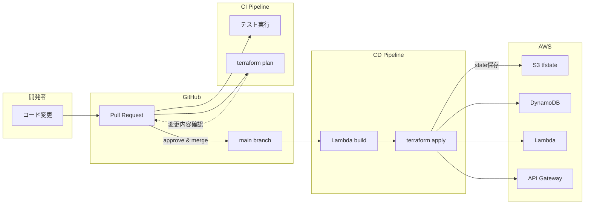
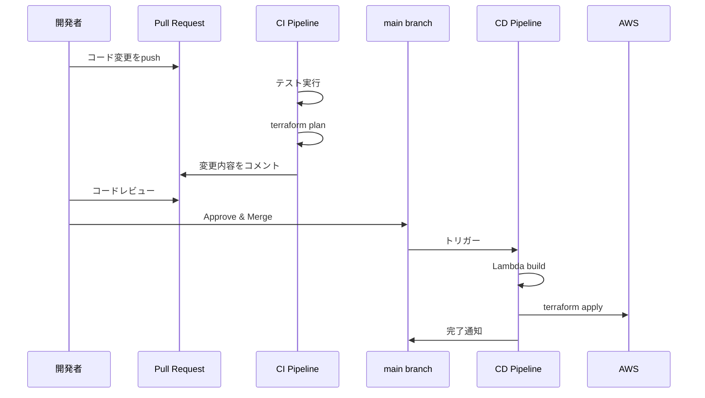
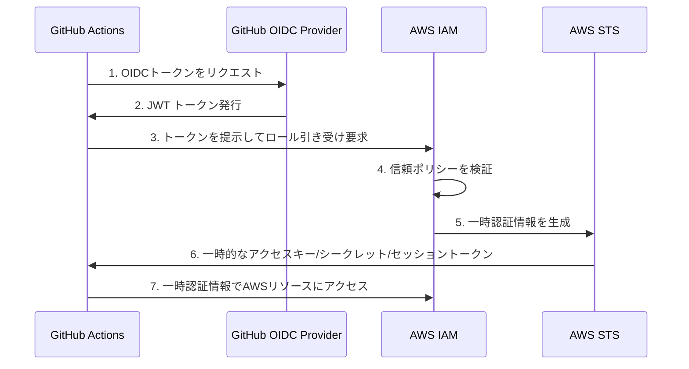

# AWS CI/CD デプロイメントフロー構築計画

## 概要

本ドキュメントは、local-gatewayプロジェクトをAWS本番環境へデプロイするためのCI/CDパイプライン構築計画を記載します。

### プロジェクト構成

- Lambda関数（Go言語）: `authz-go`, `test-function`
- Terraformモジュール: DynamoDB, Lambda, API Gateway
- ローカル開発環境（LocalStack）で動作確認済み
- 本番用Terraform設定: [`terraform/production/`](../terraform/production/)

---

## 現状分析

### 完了済み

| 項目 | 状態 | 備考 |
|------|------|------|
| Terraformモジュール | ✅ 完了 | Lambda, DynamoDB, API Gateway |
| Go Lambda関数 | ✅ 完了 | authz-go, test-function |
| ローカル開発環境 | ✅ 完了 | LocalStack + docker-compose |
| ユニットテスト | ✅ 完了 | testutil含む |

### 未着手

| 項目 | 状態 | 備考 |
|------|------|------|
| CI/CDパイプライン | ❌ 未着手 | GitHub Actions |
| AWS本番環境 | ❌ 未着手 | IAM, S3等の準備 |
| Terraform remote state | ❌ 未着手 | S3 backend設定 |

---

## 全体フロー図



---

## アーキテクチャ全体像

```
┌─────────────────────────────────────────────────────────────────────────┐
│                         CI/CD パイプライン                               │
│                                                                         │
│  ┌──────────┐    ┌──────────┐    ┌──────────┐    ┌──────────┐          │
│  │  Push/PR │───▶│   Test   │───▶│  Build   │───▶│  Deploy  │          │
│  └──────────┘    └──────────┘    └──────────┘    └──────────┘          │
│                       │               │               │                 │
│                       ▼               ▼               ▼                 │
│                  Go test          ZIP作成      Terraform apply          │
│                  go vet           S3 upload    Lambda更新               │
│                                                API Gateway更新          │
└─────────────────────────────────────────────────────────────────────────┘
                                        │
                                        ▼
┌─────────────────────────────────────────────────────────────────────────┐
│                            AWS 本番環境                                  │
│                                                                         │
│  ┌─────────────┐    ┌─────────────┐    ┌─────────────┐                 │
│  │ API Gateway │───▶│   Lambda    │───▶│  DynamoDB   │                 │
│  │   (REST)    │    │ (Authorizer │    │(AllowedTokens)                │
│  │             │    │  + Backend) │    │             │                 │
│  └─────────────┘    └─────────────┘    └─────────────┘                 │
│                                                                         │
│  ┌─────────────┐    ┌─────────────┐                                    │
│  │     S3      │    │     IAM     │                                    │
│  │ (tfstate)   │    │ (Roles)     │                                    │
│  └─────────────┘    └─────────────┘                                    │
└─────────────────────────────────────────────────────────────────────────┘
```

---

## 推奨デプロイフロー



---

## Phase 1: AWS環境準備（手動で1回だけ実施）

AWSコンソールまたはAWS CLIで以下を作成します。

| リソース | 用途 | 推奨名 |
|---------|------|--------|
| S3バケット | Terraform state保存 | `local-gateway-tfstate-<ACCOUNT_ID>` (グローバルで一意) |
| DynamoDBテーブル | State lock | `local-gateway-tfstate-lock` |
| IAM OIDC Provider | GitHub Actions認証 | - |
| IAM Role | GitHub Actionsが使用 | `github-actions-local-gateway` |

> **💡 OIDC認証を推奨する理由**: AWSアクセスキーをGitHubに保存する必要がなく、セキュリティが向上します。

### 1.1 Terraform State用リソース

CI/CDでTerraformを実行するには、stateファイルをリモートで管理する必要があります。

#### S3バケット (tfstate保存用)

> **重要**: S3バケット名はAWS全体（全リージョン・全アカウント）で一意である必要があります。
>
> **推奨命名規則**: `<組織名>-<プロジェクト名>-tfstate-<AWSアカウントID>`
>
> 例: `local-gateway-tfstate-123456789012`

```bash
# バケット作成
# 注意: バケット名はAWSアカウントIDを含めてグローバルで一意にすること
aws s3api create-bucket \
  --bucket local-gateway-tfstate-123456789012 \
  --region ap-northeast-1 \
  --create-bucket-configuration LocationConstraint=ap-northeast-1

# バージョニング有効化
aws s3api put-bucket-versioning \
  --bucket local-gateway-tfstate-123456789012 \
  --versioning-configuration Status=Enabled

# 暗号化設定
aws s3api put-bucket-encryption \
  --bucket local-gateway-tfstate-123456789012 \
  --server-side-encryption-configuration '{
    "Rules": [
      {
        "ApplyServerSideEncryptionByDefault": {
          "SSEAlgorithm": "AES256"
        }
      }
    ]
  }'
```

#### DynamoDB テーブル (state lock用)

```bash
aws dynamodb create-table \
  --table-name local-gateway-tfstate-lock \
  --attribute-definitions AttributeName=LockID,AttributeType=S \
  --key-schema AttributeName=LockID,KeyType=HASH \
  --billing-mode PAY_PER_REQUEST \
  --region ap-northeast-1
```

### 1.2 GitHub Actions用IAMロール (OIDC)

#### IAM OIDC Provider とは

**IAM OIDC Provider** は、AWS IAMの機能で、**外部のOpenID Connect (OIDC) 対応IDプロバイダー**をAWSと信頼関係で結び、**AWSアクセスキーなしで**AWSリソースにアクセスできるようにする仕組みです。

**従来の方法 vs OIDC認証**

| 方式 | 仕組み | セキュリティ |
|------|--------|-------------|
| **従来** | AWSアクセスキー・シークレットキーをGitHub Secretsに保存 | ❌ 漏洩リスク、ローテーション管理が必要 |
| **OIDC** | 一時的なトークンを発行、キーの保存不要 | ✅ 漏洩リスクなし、自動期限切れ |

**GitHub Actions での動作フロー**



**信頼の仕組み**

1. **IDプロバイダー（GitHub側）**: GitHub Actionsは `https://token.actions.githubusercontent.com` というOIDCプロバイダーを持ち、ワークフロー実行時にJWTトークンを発行します。

2. **信頼ポリシー（AWS側）**: AWSは「このGitHubリポジトリからのトークンは信頼できる」と設定し、特定のリポジトリからのリクエストのみがIAMロールを引き受けられます。

**OIDC認証のメリット**

| メリット | 説明 |
|---------|------|
| **シークレット不要** | AWSアクセスキーをGitHubに保存しない |
| **自動ローテーション** | 一時トークンは自動的に期限切れ（通常1時間） |
| **細かいアクセス制御** | リポジトリ、ブランチ、環境ごとに制限可能 |
| **監査可能** | CloudTrailでどのワークフローがアクセスしたか追跡可能 |

#### OIDC Provider作成

**方法1: AWSコンソール（最も簡単・推奨）**

1. [IAM コンソール](https://console.aws.amazon.com/iam/) > **Identity providers** > **Add provider**
2. **Provider type**: OpenID Connect を選択
3. **Provider URL**: `https://token.actions.githubusercontent.com` を入力
4. **Get thumbprint** ボタンをクリック（自動的にthumbprintを取得）
5. **Audience**: `sts.amazonaws.com` を入力
6. **Add provider** をクリック

> **参考**: AWSコンソールは「Get thumbprint」ボタンで自動的にthumbprintを取得・検証します。

**方法2: AWS CLI**

```bash
# IAMが自動的にthumbprintを取得
aws iam create-open-id-connect-provider \
  --url https://token.actions.githubusercontent.com \
  --client-id-list sts.amazonaws.com
```

`--thumbprint-list`パラメータは省略可能です。省略した場合、IAMが自動的にOIDC IdPサーバー証明書の中間CA thumbprintを取得します。

> **参考**: 2023年6月以降、GitHub ActionsとAWSのOIDC連携においてthumbprintの手動指定は不要になりました。
> - [Use IAM roles to connect GitHub Actions to AWS](https://aws.amazon.com/blogs/security/use-iam-roles-to-connect-github-actions-to-actions-in-aws/)
> - [GitHub Changelog - Update on OIDC integration with AWS](https://github.blog/changelog/2023-06-27-github-actions-update-on-oidc-integration-with-aws/)
> - [AWS CLI - create-open-id-connect-provider](https://docs.aws.amazon.com/cli/latest/reference/iam/create-open-id-connect-provider.html)

**確認方法**

```bash
# 作成されたOIDC Providerを確認
aws iam get-open-id-connect-provider \
  --open-id-connect-provider-arn arn:aws:iam::<ACCOUNT_ID>:oidc-provider/token.actions.githubusercontent.com
```

#### IAMロール作成

**信頼ポリシー (trust-policy.json)**

```json
{
  "Version": "2012-10-17",
  "Statement": [
    {
      "Effect": "Allow",
      "Principal": {
        "Federated": "arn:aws:iam::<ACCOUNT_ID>:oidc-provider/token.actions.githubusercontent.com"
      },
      "Action": "sts:AssumeRoleWithWebIdentity",
      "Condition": {
        "StringEquals": {
          "token.actions.githubusercontent.com:aud": "sts.amazonaws.com"
        },
        "StringLike": {
          "token.actions.githubusercontent.com:sub": "repo:<GITHUB_ORG>/<REPO_NAME>:*"
        }
      }
    }
  ]
}
```

**権限ポリシー (permissions-policy.json)**

```json
{
  "Version": "2012-10-17",
  "Statement": [
    {
      "Sid": "TerraformStateAccess",
      "Effect": "Allow",
      "Action": [
        "s3:GetObject",
        "s3:PutObject",
        "s3:DeleteObject",
        "s3:ListBucket"
      ],
      "Resource": [
        "arn:aws:s3:::local-gateway-tfstate",
        "arn:aws:s3:::local-gateway-tfstate/*"
      ]
    },
    {
      "Sid": "TerraformStateLock",
      "Effect": "Allow",
      "Action": [
        "dynamodb:GetItem",
        "dynamodb:PutItem",
        "dynamodb:DeleteItem"
      ],
      "Resource": "arn:aws:dynamodb:ap-northeast-1:<ACCOUNT_ID>:table/local-gateway-tfstate-lock"
    },
    {
      "Sid": "LambdaManagement",
      "Effect": "Allow",
      "Action": [
        "lambda:CreateFunction",
        "lambda:UpdateFunctionCode",
        "lambda:UpdateFunctionConfiguration",
        "lambda:DeleteFunction",
        "lambda:GetFunction",
        "lambda:ListFunctions",
        "lambda:AddPermission",
        "lambda:RemovePermission",
        "lambda:InvokeFunction"
      ],
      "Resource": "arn:aws:lambda:ap-northeast-1:<ACCOUNT_ID>:function:*"
    },
    {
      "Sid": "DynamoDBManagement",
      "Effect": "Allow",
      "Action": [
        "dynamodb:CreateTable",
        "dynamodb:DeleteTable",
        "dynamodb:DescribeTable",
        "dynamodb:UpdateTable",
        "dynamodb:ListTables"
      ],
      "Resource": "arn:aws:dynamodb:ap-northeast-1:<ACCOUNT_ID>:table/*"
    },
    {
      "Sid": "APIGatewayManagement",
      "Effect": "Allow",
      "Action": [
        "apigateway:GET",
        "apigateway:POST",
        "apigateway:PUT",
        "apigateway:PATCH",
        "apigateway:DELETE"
      ],
      "Resource": [
        "arn:aws:apigateway:ap-northeast-1::/restapis",
        "arn:aws:apigateway:ap-northeast-1::/restapis/*"
      ]
    },
    {
      "Sid": "IAMRoleManagement",
      "Effect": "Allow",
      "Action": [
        "iam:CreateRole",
        "iam:DeleteRole",
        "iam:GetRole",
        "iam:PassRole",
        "iam:AttachRolePolicy",
        "iam:DetachRolePolicy",
        "iam:PutRolePolicy",
        "iam:DeleteRolePolicy",
        "iam:GetRolePolicy",
        "iam:ListRolePolicies",
        "iam:ListAttachedRolePolicies"
      ],
      "Resource": "arn:aws:iam::<ACCOUNT_ID>:role/*"
    },
    {
      "Sid": "CloudWatchLogs",
      "Effect": "Allow",
      "Action": [
        "logs:CreateLogGroup",
        "logs:DeleteLogGroup",
        "logs:DescribeLogGroups",
        "logs:PutRetentionPolicy"
      ],
      "Resource": "*"
    }
  ]
}
```

**ロール作成コマンド**

```bash
# ロール作成
aws iam create-role \
  --role-name github-actions-local-gateway \
  --assume-role-policy-document file://trust-policy.json

# ポリシーアタッチ
aws iam put-role-policy \
  --role-name github-actions-local-gateway \
  --policy-name local-gateway-deploy \
  --policy-document file://permissions-policy.json
```

---

## Phase 2: Terraform設定更新

### 2.1 本番環境backend設定

[`terraform/production/backend.tf`](../terraform/production/backend.tf) のコメントを解除し、作成したS3バケット名を設定します。

> **注意**: `bucket`には実際に作成したバケット名（AWSアカウントIDを含むもの）を指定してください。

```hcl
terraform {
  required_version = ">= 1.5.0"

  backend "s3" {
    bucket         = "local-gateway-tfstate-123456789012"  # 実際のバケット名に置き換える
    key            = "production/terraform.tfstate"
    region         = "ap-northeast-1"
    encrypt        = true
    dynamodb_table = "local-gateway-tfstate-lock"
  }

  required_providers {
    aws = {
      source  = "hashicorp/aws"
      version = "~> 5.0"
    }
  }
}

provider "aws" {
  region = "ap-northeast-1"

  default_tags {
    tags = {
      Project     = "local-gateway"
      Environment = "production"
      ManagedBy   = "terraform"
    }
  }
}
```

---

## Phase 3: GitHub Actions設定

### 3.1 ワークフロー構成

```
.github/
└── workflows/
    ├── ci.yml          # テスト・ビルド (PR時)
    └── deploy.yml      # デプロイ (main push時)
```

| ワークフロー | トリガー | 処理内容 |
|------------|---------|---------|
| **CI** | Pull Requestの作成/更新 | テスト実行、terraform plan（変更内容をPRにコメント） |
| **CD** | mainブランチへのpush | Lambdaビルド、terraform apply（自動デプロイ） |

#### CI/CDでの統合テスト

**LocalStackをサービスコンテナとして起動**

GitHub Actionsでは、LocalStackをサービスコンテナとして起動することで、ローカル開発環境と同じ統合テストを実行できます。

**テスト環境の構成:**

```yaml
services:
  localstack:
    image: localstack/localstack:latest
    env:
      SERVICES: dynamodb  # DynamoDBのみ起動（高速化）
      DEBUG: 0
    ports:
      - 4566:4566
```

**重要なポイント:**

| 項目 | 説明 |
|------|------|
| **Terraform不要** | テストコード自体が`testutil.EnsureTable`でDynamoDBテーブルを作成・削除するため、Terraformによるインフラ構築は不要 |
| **ローカルと同等** | LocalStackのDynamoDBエミュレータを使用し、ローカル開発環境（docker-compose）と同じテストを実行 |
| **統合テスト実行** | モックではなく、実際のDynamoDB APIを使った統合テストが可能 |
| **高速起動** | `SERVICES: dynamodb`で必要最小限のサービスのみ起動 |

**環境変数の設定:**

```yaml
env:
  AWS_ENDPOINT_URL: http://localhost:4566  # LocalStackエンドポイント
  AWS_ACCESS_KEY_ID: test                  # ダミー認証情報
  AWS_SECRET_ACCESS_KEY: test
  AWS_REGION: ap-northeast-1
```

これにより、`testutil.NewDynamoDBClient`がLocalStackに接続し、テストが実行されます。

#### Terraform Plan とは

**Terraform Plan = インフラ変更の事前プレビュー**

Terraformには2つの重要なコマンドがあります：

| コマンド | 役割 | 例え |
|---------|------|------|
| `terraform plan` | 変更内容の**プレビュー**（実行前確認） | 映画の予告編 |
| `terraform apply` | 実際の**変更実行**（リソース作成・更新・削除） | 本編の上映 |

**具体的な出力例:**

```terraform
Terraform will perform the following actions:

  # module.lambda_authorizer.aws_lambda_function.main will be updated in-place
  ~ resource "aws_lambda_function" "main" {
        id            = "authz-go"
      ~ memory_size   = 128 -> 256  # メモリを変更
        # (10 unchanged attributes hidden)
    }

Plan: 0 to add, 1 to change, 0 to destroy.
```

この例では：
- Lambda関数`authz-go`のメモリが128MB→256MBに変更される
- リソースの追加・削除はなし
- 変更は1件のみ

**CI/CDでの活用:**

| ステージ | 使用コマンド | 目的 |
|---------|------------|------|
| **PR作成時** | `terraform plan` | 変更内容をレビュー、意図しない変更がないか確認 |
| **mainマージ後** | `terraform apply` | 変更を本番環境に適用 |

**メリット:**
- 🔍 **事前確認**: インフラへの影響を適用前に把握
- 🛡️ **事故防止**: 意図しないリソース削除や設定ミスを発見
- 👥 **レビュー**: PRコメントで変更内容をチーム全体で確認可能

### 3.2 CI ワークフロー (.github/workflows/ci.yml)

```yaml
name: CI

on:
  pull_request:
    branches: [main]

permissions:
  contents: read
  id-token: write
  pull-requests: write

env:
  GO_VERSION: '1.25'
  AWS_REGION: 'ap-northeast-1'

jobs:
  test:
    name: Test
    runs-on: ubuntu-latest
    services:
      localstack:
        image: localstack/localstack:latest
        env:
          SERVICES: dynamodb
          DEBUG: 0
        ports:
          - 4566:4566
        options: >-
          --health-cmd "curl -f http://localhost:4566/_localstack/health || exit 1"
          --health-interval 10s
          --health-timeout 5s
          --health-retries 5
    steps:
      - name: Checkout
        uses: actions/checkout@v4

      - name: Setup Go
        uses: actions/setup-go@v5
        with:
          go-version: ${{ env.GO_VERSION }}

      - name: Run tests
        working-directory: lambda
        env:
          AWS_ENDPOINT_URL: http://localhost:4566
          AWS_ACCESS_KEY_ID: test
          AWS_SECRET_ACCESS_KEY: test
          AWS_REGION: ap-northeast-1
        run: |
          go work sync
          go test -v ./...

  build:
    name: Build
    runs-on: ubuntu-latest
    needs: test
    steps:
      - name: Checkout
        uses: actions/checkout@v4

      - name: Setup Go
        uses: actions/setup-go@v5
        with:
          go-version: ${{ env.GO_VERSION }}

      - name: Build Lambda functions
        working-directory: lambda
        run: |
          go work sync
          for dir in authz-go test-function; do
            cd $dir
            GOOS=linux GOARCH=amd64 CGO_ENABLED=0 go build -o bootstrap main.go
            zip function.zip bootstrap
            cd ..
          done

      - name: Verify Lambda packages
        working-directory: lambda
        run: |
          for dir in authz-go test-function; do
            echo "=== Verifying $dir/function.zip ==="

            # ZIPファイルの整合性チェック
            unzip -t "$dir/function.zip"

            # 内容一覧表示 & bootstrap存在確認
            unzip -l "$dir/function.zip" | grep bootstrap || (echo "ERROR: bootstrap not found in $dir/function.zip" && exit 1)

            # ファイルサイズ確認（空でないことを確認）
            size=$(stat -c%s "$dir/function.zip" 2>/dev/null || stat -f%z "$dir/function.zip")
            if [ "$size" -lt 1000 ]; then
              echo "ERROR: $dir/function.zip is too small ($size bytes)"
              exit 1
            fi

            echo "✓ $dir/function.zip is valid (size: $size bytes)"
          done

      - name: Upload artifacts
        uses: actions/upload-artifact@v4
        with:
          name: lambda-packages
          path: |
            lambda/authz-go/function.zip
            lambda/test-function/function.zip

  plan:
    name: Terraform Plan
    runs-on: ubuntu-latest
    needs: build
    steps:
      - name: Checkout
        uses: actions/checkout@v4

      - name: Download artifacts
        uses: actions/download-artifact@v4
        with:
          name: lambda-packages
          path: lambda

      - name: Configure AWS credentials
        uses: aws-actions/configure-aws-credentials@v4
        with:
          role-to-assume: ${{ secrets.AWS_ROLE_ARN }}
          aws-region: ${{ env.AWS_REGION }}

      - name: Setup Terraform
        uses: hashicorp/setup-terraform@v3
        with:
          terraform_version: 1.5.0

      - name: Terraform Init
        working-directory: terraform/production
        run: terraform init

      - name: Terraform Plan
        id: plan
        working-directory: terraform/production
        run: |
          terraform plan -no-color -out=tfplan 2>&1 | tee plan-output.txt
        continue-on-error: true

      - name: Comment PR
        if: github.event_name == 'pull_request'
        uses: actions/github-script@v7
        with:
          script: |
            const fs = require('fs');
            const planOutput = fs.readFileSync('terraform/production/plan-output.txt', 'utf8');

            // Plan結果のサマリーを抽出
            const planSummary = planOutput.match(/Plan: .+/);
            const exitCode = '${{ steps.plan.outcome }}';

            const output = `#### Terraform Plan 📖 \`${exitCode}\`

            <details><summary>Show Plan</summary>

            \`\`\`terraform
            ${planOutput.slice(-60000)}
            \`\`\`

            </details>

            ${planSummary ? `**${planSummary[0]}**` : ''}

            *Pushed by: @${{ github.actor }}, Action: \`${{ github.event_name }}\`*`;

            github.rest.issues.createComment({
              issue_number: context.issue.number,
              owner: context.repo.owner,
              repo: context.repo.repo,
              body: output
            })
```

### 3.3 Deploy ワークフロー (.github/workflows/deploy.yml)

```yaml
name: Deploy

on:
  push:
    branches: [main]

permissions:
  contents: read
  id-token: write

env:
  GO_VERSION: '1.25'
  AWS_REGION: 'ap-northeast-1'

jobs:
  test:
    name: Test
    runs-on: ubuntu-latest
    services:
      localstack:
        image: localstack/localstack:latest
        env:
          SERVICES: dynamodb
          DEBUG: 0
        ports:
          - 4566:4566
        options: >-
          --health-cmd "curl -f http://localhost:4566/_localstack/health || exit 1"
          --health-interval 10s
          --health-timeout 5s
          --health-retries 5
    steps:
      - name: Checkout
        uses: actions/checkout@v4

      - name: Setup Go
        uses: actions/setup-go@v5
        with:
          go-version: ${{ env.GO_VERSION }}

      - name: Run tests
        working-directory: lambda
        env:
          AWS_ENDPOINT_URL: http://localhost:4566
          AWS_ACCESS_KEY_ID: test
          AWS_SECRET_ACCESS_KEY: test
          AWS_REGION: ap-northeast-1
        run: |
          go work sync
          go test -v ./...

  build:
    name: Build
    runs-on: ubuntu-latest
    needs: test
    steps:
      - name: Checkout
        uses: actions/checkout@v4

      - name: Setup Go
        uses: actions/setup-go@v5
        with:
          go-version: ${{ env.GO_VERSION }}

      - name: Build Lambda functions
        working-directory: lambda
        run: |
          go work sync
          for dir in authz-go test-function; do
            cd $dir
            GOOS=linux GOARCH=amd64 CGO_ENABLED=0 go build -o bootstrap main.go
            zip function.zip bootstrap
            cd ..
          done

      - name: Verify Lambda packages
        working-directory: lambda
        run: |
          for dir in authz-go test-function; do
            echo "=== Verifying $dir/function.zip ==="

            # ZIPファイルの整合性チェック
            unzip -t "$dir/function.zip"

            # 内容一覧表示 & bootstrap存在確認
            unzip -l "$dir/function.zip" | grep bootstrap || (echo "ERROR: bootstrap not found in $dir/function.zip" && exit 1)

            # ファイルサイズ確認（空でないことを確認）
            size=$(stat -c%s "$dir/function.zip" 2>/dev/null || stat -f%z "$dir/function.zip")
            if [ "$size" -lt 1000 ]; then
              echo "ERROR: $dir/function.zip is too small ($size bytes)"
              exit 1
            fi

            echo "✓ $dir/function.zip is valid (size: $size bytes)"
          done

      - name: Upload artifacts
        uses: actions/upload-artifact@v4
        with:
          name: lambda-packages
          path: |
            lambda/authz-go/function.zip
            lambda/test-function/function.zip

  deploy:
    name: Deploy
    runs-on: ubuntu-latest
    needs: build
    environment: production
    steps:
      - name: Checkout
        uses: actions/checkout@v4

      - name: Download artifacts
        uses: actions/download-artifact@v4
        with:
          name: lambda-packages
          path: lambda

      - name: Configure AWS credentials
        uses: aws-actions/configure-aws-credentials@v4
        with:
          role-to-assume: ${{ secrets.AWS_ROLE_ARN }}
          aws-region: ${{ env.AWS_REGION }}

      - name: Setup Terraform
        uses: hashicorp/setup-terraform@v3
        with:
          terraform_version: 1.5.0

      - name: Terraform Init
        working-directory: terraform/production
        run: terraform init

      - name: Terraform Apply
        working-directory: terraform/production
        run: terraform apply -auto-approve

      - name: Output API URL
        working-directory: terraform/production
        run: |
          echo "## Deployment Complete" >> $GITHUB_STEP_SUMMARY
          echo "API Gateway URL: $(terraform output -raw api_gateway_invoke_url)" >> $GITHUB_STEP_SUMMARY
```

### 3.4 GitHub Secrets設定

**重要**: GitHub ActionsワークフローでOIDC認証を使用するには、作成したIAMロールのARNをGitHub Secretsに登録する必要があります。

#### 設定手順

1. GitHubリポジトリで **Settings > Secrets and variables > Actions** に移動
2. **New repository secret** をクリック
3. 以下のSecretを追加:

| Secret名 | 値 | 説明 |
|----------|-----|------|
| `AWS_ROLE_ARN` | `arn:aws:iam::<ACCOUNT_ID>:role/github-actions-local-gateway` | GitHub ActionsがAssumeするIAMロールのARN |

#### 使用例（ワークフロー内）

```yaml
- name: Configure AWS credentials
  uses: aws-actions/configure-aws-credentials@v4
  with:
    role-to-assume: ${{ secrets.AWS_ROLE_ARN }}  # ← ここでSecretを参照
    aws-region: ap-northeast-1
```

> **注意**: OIDC ProviderのARN (`arn:aws:iam::<ACCOUNT_ID>:oidc-provider/token.actions.githubusercontent.com`) はワークフローに記載する必要はありません。IAMロールのARNのみを指定します。

---

## Phase 4: 実行手順チェックリスト

### Step 1: AWS環境準備

- [ ] S3バケット作成 (tfstate用)
- [ ] DynamoDBテーブル作成 (state lock用)
- [ ] OIDC Provider作成
- [ ] IAMロール作成

### Step 2: Terraform設定

- [ ] `terraform/production/backend.tf` backend設定有効化
- [ ] ローカルで `terraform init` 実行確認

### Step 3: GitHub設定

- [ ] `.github/workflows/ci.yml` 作成
- [ ] `.github/workflows/deploy.yml` 作成
- [ ] GitHub Secrets設定 (`AWS_ROLE_ARN`)
- [ ] GitHub Environment作成 (`production`)

### Step 4: 動作確認

- [ ] PRを作成してCI実行確認
- [ ] terraform plan結果確認
- [ ] mainにマージしてデプロイ確認
- [ ] API Gateway URL疎通確認

---

## セキュリティ考慮事項

| 項目 | 対策 |
|------|------|
| AWSクレデンシャル | OIDC連携でアクセスキー不使用 |
| Terraform state | S3暗号化 + バージョニング有効 |
| State lock | DynamoDB による排他制御 |
| IAM権限 | 最小権限の原則に基づく設計 |
| 本番デプロイ | GitHub Environment保護ルール設定可能 |

---

## 拡張性

将来的にステージング環境を追加する場合は、以下の対応で拡張可能です：

1. `terraform/staging/` ディレクトリを作成
2. ワークフローにステージング用のジョブを追加
3. GitHub Environmentに `staging` を追加

---

## 参考リンク

- [GitHub Actions OIDC with AWS](https://docs.github.com/en/actions/deployment/security-hardening-your-deployments/configuring-openid-connect-in-amazon-web-services)
- [Terraform S3 Backend](https://developer.hashicorp.com/terraform/language/settings/backends/s3)
- [AWS Lambda Go](https://docs.aws.amazon.com/lambda/latest/dg/golang-handler.html)

---

## 実装状況

### 完了した実装 ✅

| 項目 | 実装内容 | 備考 |
|------|---------|------|
| **CI ワークフロー** | `.github/workflows/ci.yml` | test → build → terraform plan |
| **Deploy ワークフロー** | `.github/workflows/deploy.yml` | test → build → terraform apply |
| **Reusable Workflow** | `_reusable-test.yml`, `_reusable-build.yml` | testとbuildを分離して再利用可能に |
| **動的ビルド** | Lambda関数の自動検出 | `lambda/*/main.go`を動的検出 |
| **Terraform Backend** | `terraform/production/backend.tf` | S3バックエンド設定を有効化 |

### 実装の改善点

**計画からの主な変更:**

1. **Reusable Workflowの分離**
   - 当初: `_reusable-test-build.yml` (test + build統合)
   - 実装: `_reusable-test.yml` + `_reusable-build.yml` (分離)
   - **理由**: 柔軟性の向上、単一責任の原則

2. **動的Lambda関数検出**
   - 当初: `for dir in authz-go test-function; do` (固定)
   - 実装: `for dir in */; do if [ -f "$dir/main.go" ]; then` (動的)
   - **理由**: Lambda関数追加時にワークフロー修正不要

3. **Terraformは明示的定義を維持**
   - **判断**: GitHub Actionsは動的、Terraformは明示的
   - **理由**: インフラコードは可読性を優先

### ユーザーが実施すべき残りタスク

#### Phase 1: AWS環境準備
- [ ] S3バケット作成 (tfstate用)
- [ ] DynamoDBテーブル作成 (state lock用)
- [ ] OIDC Provider作成
- [ ] IAMロール作成

#### Phase 3: GitHub設定
- [ ] `terraform/production/backend.tf`の`<ACCOUNT_ID>`を実際のAWSアカウントIDに置き換え
- [ ] GitHub Secrets設定: `AWS_ROLE_ARN`
- [ ] GitHub Environment作成: `production`
- [ ] ブランチ保護ルール設定（推奨）

#### Phase 4: 動作確認
- [ ] PRを作成してCI実行確認
- [ ] terraform plan結果確認
- [ ] mainにマージしてデプロイ確認
- [ ] API Gateway URL疎通確認

---

## 更新履歴

| 日付 | 内容 |
|------|------|
| 2026-01-20 | CI/CD実装完了、動的ビルド対応、Reusable Workflow分離 |
| 2026-01-19 | 概要版と詳細版を統合 |
| 2026-01-18 | 初版作成 |
