```mermaid
sequenceDiagram
    participant Dev as 開発者
    participant PR as Pull Request
    participant CI as CI Pipeline
    participant Main as main branch
    participant CD as CD Pipeline
    participant AWS as AWS

    Dev->>PR: コード変更をpush
    CI->>CI: テスト実行
    CI->>CI: terraform plan
    CI->>PR: 変更内容をコメント
    Dev->>PR: コードレビュー
    Dev->>Main: Approve & Merge
    Main->>CD: トリガー
    CD->>CD: Lambda build
    CD->>AWS: terraform apply
    CD->>Main: 完了通知
```

# AWS CI/CD デプロイメントフロー構築計画

## 概要

本ドキュメントは、local-gatewayプロジェクトをAWS本番環境へデプロイするためのCI/CDパイプライン構築計画を記載します。

### プロジェクト構成

- Lambda関数（Go言語）: `authz-go`, `test-function`
- Terraformモジュール: DynamoDB, Lambda, API Gateway
- ローカル開発環境（LocalStack）で動作確認済み
- 本番用Terraform設定: [`terraform/production/`](../terraform/production/)

---

## 現状分析

### 完了済み

| 項目 | 状態 | 備考 |
|------|------|------|
| Terraformモジュール | ✅ 完了 | Lambda, DynamoDB, API Gateway |
| Go Lambda関数 | ✅ 完了 | authz-go, test-function |
| ローカル開発環境 | ✅ 完了 | LocalStack + docker-compose |
| ユニットテスト | ✅ 完了 | testutil含む |

### 未着手

| 項目 | 状態 | 備考 |
|------|------|------|
| CI/CDパイプライン | ❌ 未着手 | GitHub Actions |
| AWS本番環境 | ❌ 未着手 | IAM, S3等の準備 |
| Terraform remote state | ❌ 未着手 | S3 backend設定 |

---

## 全体フロー図

```mermaid
flowchart LR
    subgraph Developer [開発者]
        Code[コード変更]
    end
    
    subgraph GitHub [GitHub]
        PR[Pull Request]
        Main[main branch]
    end
    
    subgraph CI [CI Pipeline]
        Test[テスト実行]
        Plan[terraform plan]
    end
    
    subgraph CD [CD Pipeline]
        Build[Lambda build]
        Apply[terraform apply]
    end
    
    subgraph AWS [AWS]
        S3[S3 tfstate]
        DynamoDB[DynamoDB]
        Lambda[Lambda]
        APIGateway[API Gateway]
    end
    
    Code --> PR
    PR --> Test
    PR --> Plan
    Plan -.->|変更内容確èª| PR
    PR -->|approve & merge| Main
    Main --> Build
    Build --> Apply
    Apply --> Lambda
    Apply --> DynamoDB
    Apply --> APIGateway
    Apply -->|stateä¿å­˜| S3
```



---

## アーキテクチャ全体像

```
┌─────────────────────────────────────────────────────────────────────────┐
│                         CI/CD パイプライン                               │
│                                                                         │
│  ┌──────────┐    ┌──────────┐    ┌──────────┐    ┌──────────┐          │
│  │  Push/PR │───▶│   Test   │───▶│  Build   │───▶│  Deploy  │          │
│  └──────────┘    └──────────┘    └──────────┘    └──────────┘          │
│                       │               │               │                 │
│                       ▼               ▼               ▼                 │
│                  Go test          ZIP作成      Terraform apply          │
│                  go vet           S3 upload    Lambda更新               │
│                                                API Gateway更新          │
└─────────────────────────────────────────────────────────────────────────┘
                                        │
                                        ▼
┌─────────────────────────────────────────────────────────────────────────┐
│                            AWS 本番環境                                  │
│                                                                         │
│  ┌─────────────┐    ┌─────────────┐    ┌─────────────┐                 │
│  │ API Gateway │───▶│   Lambda    │───▶│  DynamoDB   │                 │
│  │   (REST)    │    │ (Authorizer │    │(AllowedTokens)                │
│  │             │    │  + Backend) │    │             │                 │
│  └─────────────┘    └─────────────┘    └─────────────┘                 │
│                                                                         │
│  ┌─────────────┐    ┌─────────────┐                                    │
│  │     S3      │    │     IAM     │                                    │
│  │ (tfstate)   │    │ (Roles)     │                                    │
│  └─────────────┘    └─────────────┘                                    │
└─────────────────────────────────────────────────────────────────────────┘
```

---

## 推奨デプロイフロー



---

## Phase 1: AWS環境準備（手動で1回だけ実施）

AWS環境のセットアップ手順については、[docs/aws-manual-setup.md](./aws-manual-setup.md)を参照してください。

以下のリソースを作成する必要があります：

| リソース | 用途 | 推奨名 |
|---------|------|--------|
| S3バケット | Terraform state保存 | `local-gateway-tfstate-<ACCOUNT_ID>` |
| DynamoDBテーブル | State lock | `local-gateway-tfstate-lock` |
| IAM OIDC Provider | GitHub Actions認証 | `token.actions.githubusercontent.com` |
| IAM Role | GitHub Actionsが使用 | `github-actions-local-gateway` |

> **💡 詳細な手順**: [AWS環境手動セットアップガイド](./aws-manual-setup.md)を参照してください。

---

## Phase 2: Terraform設定更新

### 2.1 本番環境backend設定

[`terraform/production/backend.tf`](../terraform/production/backend.tf) は空のS3バックエンド設定になっています。

実際のバケット名などの設定は、GitHub Actionsワークフロー内で `-backend-config` パラメータを使用して動的に指定します。

```hcl
terraform {
  backend "s3" {
    # GitHub Actionsで -backend-config パラメータにて設定
  }
}
```

**GitHub Actionsでの設定例:**

```yaml
- name: Terraform Init
  working-directory: terraform/production
  run: |
    terraform init \
      -backend-config="bucket=${{ secrets.TF_STATE_BUCKET }}" \
      -backend-config="key=production/terraform.tfstate" \
      -backend-config="region=${{ env.AWS_REGION }}" \
      -backend-config="dynamodb_table=local-gateway-tfstate-lock" \
      -backend-config="encrypt=true"
```

> **注意**: バケット名は GitHub Secrets の `TF_STATE_BUCKET` で管理されます。詳細は [docs/aws-manual-setup.md](./aws-manual-setup.md) を参照してください。

---

## Phase 3: GitHub Actions設定

### 3.1 ワークフロー構成

```
.github/
└── workflows/
    ├── ci.yml          # テスト・ビルド (PR時)
    └── deploy.yml      # デプロイ (main push時)
```

| ワークフロー | トリガー | 処理内容 |
|------------|---------|---------|
| **CI** | Pull Requestの作成/更新 | テスト実行、terraform plan（変更内容をPRにコメント） |
| **CD** | mainブランチへのpush | Lambdaビルド、terraform apply（自動デプロイ） |

#### CI/CDでの統合テスト

**LocalStackをサービスコンテナとして起動**

GitHub Actionsでは、LocalStackをサービスコンテナとして起動することで、ローカル開発環境と同じ統合テストを実行できます。

**テスト環境の構成:**

```yaml
services:
  localstack:
    image: localstack/localstack:latest
    env:
      SERVICES: dynamodb  # DynamoDBのみ起動（高速化）
      DEBUG: 0
    ports:
      - 4566:4566
```

**重要なポイント:**

| 項目 | 説明 |
|------|------|
| **Terraform不要** | テストコード自体が`testutil.EnsureTable`でDynamoDBテーブルを作成・削除するため、Terraformによるインフラ構築は不要 |
| **ローカルと同等** | LocalStackのDynamoDBエミュレータを使用し、ローカル開発環境（docker-compose）と同じテストを実行 |
| **統合テスト実行** | モックではなく、実際のDynamoDB APIを使った統合テストが可能 |
| **高速起動** | `SERVICES: dynamodb`で必要最小限のサービスのみ起動 |

**環境変数の設定:**

```yaml
env:
  AWS_ENDPOINT_URL: http://localhost:4566  # LocalStackエンドポイント
  AWS_ACCESS_KEY_ID: test                  # ダミー認証情報
  AWS_SECRET_ACCESS_KEY: test
  AWS_REGION: ap-northeast-1
```

これにより、`testutil.NewDynamoDBClient`がLocalStackに接続し、テストが実行されます。

#### Terraform Plan とは

**Terraform Plan = インフラ変更の事前プレビュー**

Terraformには2つの重要なコマンドがあります：

| コマンド | 役割 | 例え |
|---------|------|------|
| `terraform plan` | 変更内容の**プレビュー**（実行前確認） | 映画の予告編 |
| `terraform apply` | 実際の**変更実行**（リソース作成・更新・削除） | 本編の上映 |

**具体的な出力例:**

```terraform
Terraform will perform the following actions:

  # module.lambda_authorizer.aws_lambda_function.main will be updated in-place
  ~ resource "aws_lambda_function" "main" {
        id            = "authz-go"
      ~ memory_size   = 128 -> 256  # メモリを変更
        # (10 unchanged attributes hidden)
    }

Plan: 0 to add, 1 to change, 0 to destroy.
```

この例では：
- Lambda関数`authz-go`のメモリが128MB→256MBに変更される
- リソースの追加・削除はなし
- 変更は1件のみ

**CI/CDでの活用:**

| ステージ | 使用コマンド | 目的 |
|---------|------------|------|
| **PR作成時** | `terraform plan` | 変更内容をレビュー、意図しない変更がないか確認 |
| **mainマージ後** | `terraform apply` | 変更を本番環境に適用 |

**メリット:**
- 🔍 **事前確認**: インフラへの影響を適用前に把握
- 🛡️ **事故防止**: 意図しないリソース削除や設定ミスを発見
- 👥 **レビュー**: PRコメントで変更内容をチーム全体で確認可能

### 3.2 CI ワークフロー (.github/workflows/ci.yml)

```yaml
name: CI

on:
  pull_request:
    branches: [main]

permissions:
  contents: read
  id-token: write
  pull-requests: write

env:
  GO_VERSION: '1.25'
  AWS_REGION: 'ap-northeast-1'

jobs:
  test:
    name: Test
    runs-on: ubuntu-latest
    services:
      localstack:
        image: localstack/localstack:latest
        env:
          SERVICES: dynamodb
          DEBUG: 0
        ports:
          - 4566:4566
        options: >-
          --health-cmd "curl -f http://localhost:4566/_localstack/health || exit 1"
          --health-interval 10s
          --health-timeout 5s
          --health-retries 5
    steps:
      - name: Checkout
        uses: actions/checkout@v4

      - name: Setup Go
        uses: actions/setup-go@v5
        with:
          go-version: ${{ env.GO_VERSION }}

      - name: Run tests
        working-directory: lambda
        env:
          AWS_ENDPOINT_URL: http://localhost:4566
          AWS_ACCESS_KEY_ID: test
          AWS_SECRET_ACCESS_KEY: test
          AWS_REGION: ap-northeast-1
        run: |
          go work sync
          go test -v ./...

  build:
    name: Build
    runs-on: ubuntu-latest
    needs: test
    steps:
      - name: Checkout
        uses: actions/checkout@v4

      - name: Setup Go
        uses: actions/setup-go@v5
        with:
          go-version: ${{ env.GO_VERSION }}

      - name: Build Lambda functions
        working-directory: lambda
        run: |
          go work sync
          for dir in authz-go test-function; do
            cd $dir
            GOOS=linux GOARCH=amd64 CGO_ENABLED=0 go build -o bootstrap main.go
            zip function.zip bootstrap
            cd ..
          done

      - name: Verify Lambda packages
        working-directory: lambda
        run: |
          for dir in authz-go test-function; do
            echo "=== Verifying $dir/function.zip ==="

            # ZIPファイルの整合性チェック
            unzip -t "$dir/function.zip"

            # 内容一覧表示 & bootstrap存在確認
            unzip -l "$dir/function.zip" | grep bootstrap || (echo "ERROR: bootstrap not found in $dir/function.zip" && exit 1)

            # ファイルサイズ確認（空でないことを確認）
            size=$(stat -c%s "$dir/function.zip" 2>/dev/null || stat -f%z "$dir/function.zip")
            if [ "$size" -lt 1000 ]; then
              echo "ERROR: $dir/function.zip is too small ($size bytes)"
              exit 1
            fi

            echo "✓ $dir/function.zip is valid (size: $size bytes)"
          done

      - name: Upload artifacts
        uses: actions/upload-artifact@v4
        with:
          name: lambda-packages
          path: |
            lambda/authz-go/function.zip
            lambda/test-function/function.zip

  plan:
    name: Terraform Plan
    runs-on: ubuntu-latest
    needs: build
    steps:
      - name: Checkout
        uses: actions/checkout@v4

      - name: Download artifacts
        uses: actions/download-artifact@v4
        with:
          name: lambda-packages
          path: lambda

      - name: Configure AWS credentials
        uses: aws-actions/configure-aws-credentials@v4
        with:
          role-to-assume: ${{ secrets.AWS_ROLE_ARN }}
          aws-region: ${{ env.AWS_REGION }}

      - name: Setup Terraform
        uses: hashicorp/setup-terraform@v3
        with:
          terraform_version: 1.5.0

      - name: Terraform Init
        working-directory: terraform/production
        run: terraform init

      - name: Terraform Plan
        id: plan
        working-directory: terraform/production
        run: |
          terraform plan -no-color -out=tfplan 2>&1 | tee plan-output.txt
        continue-on-error: true

      - name: Comment PR
        if: github.event_name == 'pull_request'
        uses: actions/github-script@v7
        with:
          script: |
            const fs = require('fs');
            const planOutput = fs.readFileSync('terraform/production/plan-output.txt', 'utf8');

            // Plan結果のサマリーを抽出
            const planSummary = planOutput.match(/Plan: .+/);
            const exitCode = '${{ steps.plan.outcome }}';

            const output = `#### Terraform Plan 📖 \`${exitCode}\`

            <details><summary>Show Plan</summary>

            \`\`\`terraform
            ${planOutput.slice(-60000)}
            \`\`\`

            </details>

            ${planSummary ? `**${planSummary[0]}**` : ''}

            *Pushed by: @${{ github.actor }}, Action: \`${{ github.event_name }}\`*`;

            github.rest.issues.createComment({
              issue_number: context.issue.number,
              owner: context.repo.owner,
              repo: context.repo.repo,
              body: output
            })
```

### 3.3 Deploy ワークフロー (.github/workflows/deploy.yml)

```yaml
name: Deploy

on:
  push:
    branches: [main]

permissions:
  contents: read
  id-token: write

env:
  GO_VERSION: '1.25'
  AWS_REGION: 'ap-northeast-1'

jobs:
  test:
    name: Test
    runs-on: ubuntu-latest
    services:
      localstack:
        image: localstack/localstack:latest
        env:
          SERVICES: dynamodb
          DEBUG: 0
        ports:
          - 4566:4566
        options: >-
          --health-cmd "curl -f http://localhost:4566/_localstack/health || exit 1"
          --health-interval 10s
          --health-timeout 5s
          --health-retries 5
    steps:
      - name: Checkout
        uses: actions/checkout@v4

      - name: Setup Go
        uses: actions/setup-go@v5
        with:
          go-version: ${{ env.GO_VERSION }}

      - name: Run tests
        working-directory: lambda
        env:
          AWS_ENDPOINT_URL: http://localhost:4566
          AWS_ACCESS_KEY_ID: test
          AWS_SECRET_ACCESS_KEY: test
          AWS_REGION: ap-northeast-1
        run: |
          go work sync
          go test -v ./...

  build:
    name: Build
    runs-on: ubuntu-latest
    needs: test
    steps:
      - name: Checkout
        uses: actions/checkout@v4

      - name: Setup Go
        uses: actions/setup-go@v5
        with:
          go-version: ${{ env.GO_VERSION }}

      - name: Build Lambda functions
        working-directory: lambda
        run: |
          go work sync
          for dir in authz-go test-function; do
            cd $dir
            GOOS=linux GOARCH=amd64 CGO_ENABLED=0 go build -o bootstrap main.go
            zip function.zip bootstrap
            cd ..
          done

      - name: Verify Lambda packages
        working-directory: lambda
        run: |
          for dir in authz-go test-function; do
            echo "=== Verifying $dir/function.zip ==="

            # ZIPファイルの整合性チェック
            unzip -t "$dir/function.zip"

            # 内容一覧表示 & bootstrap存在確認
            unzip -l "$dir/function.zip" | grep bootstrap || (echo "ERROR: bootstrap not found in $dir/function.zip" && exit 1)

            # ファイルサイズ確認（空でないことを確認）
            size=$(stat -c%s "$dir/function.zip" 2>/dev/null || stat -f%z "$dir/function.zip")
            if [ "$size" -lt 1000 ]; then
              echo "ERROR: $dir/function.zip is too small ($size bytes)"
              exit 1
            fi

            echo "✓ $dir/function.zip is valid (size: $size bytes)"
          done

      - name: Upload artifacts
        uses: actions/upload-artifact@v4
        with:
          name: lambda-packages
          path: |
            lambda/authz-go/function.zip
            lambda/test-function/function.zip

  deploy:
    name: Deploy
    runs-on: ubuntu-latest
    needs: build
    environment: production
    steps:
      - name: Checkout
        uses: actions/checkout@v4

      - name: Download artifacts
        uses: actions/download-artifact@v4
        with:
          name: lambda-packages
          path: lambda

      - name: Configure AWS credentials
        uses: aws-actions/configure-aws-credentials@v4
        with:
          role-to-assume: ${{ secrets.AWS_ROLE_ARN }}
          aws-region: ${{ env.AWS_REGION }}

      - name: Setup Terraform
        uses: hashicorp/setup-terraform@v3
        with:
          terraform_version: 1.5.0

      - name: Terraform Init
        working-directory: terraform/production
        run: terraform init

      - name: Terraform Apply
        working-directory: terraform/production
        run: terraform apply -auto-approve

      - name: Output API URL
        working-directory: terraform/production
        run: |
          echo "## Deployment Complete" >> $GITHUB_STEP_SUMMARY
          echo "API Gateway URL: $(terraform output -raw api_gateway_invoke_url)" >> $GITHUB_STEP_SUMMARY
```

### 3.4 GitHub Secrets設定

**重要**: GitHub ActionsワークフローでOIDC認証を使用するには、作成したIAMロールのARNをGitHub Secretsに登録する必要があります。

#### 設定手順

1. GitHubリポジトリで **Settings > Secrets and variables > Actions** に移動
2. **New repository secret** をクリック
3. 以下のSecretを追加:

| Secret名 | 値 | 説明 |
|----------|-----|------|
| `AWS_ROLE_ARN` | `arn:aws:iam::<ACCOUNT_ID>:role/github-actions-local-gateway` | GitHub ActionsがAssumeするIAMロールのARN |

#### 使用例（ワークフロー内）

```yaml
- name: Configure AWS credentials
  uses: aws-actions/configure-aws-credentials@v4
  with:
    role-to-assume: ${{ secrets.AWS_ROLE_ARN }}  # ← ここでSecretを参照
    aws-region: ap-northeast-1
```

> **注意**: OIDC ProviderのARN (`arn:aws:iam::<ACCOUNT_ID>:oidc-provider/token.actions.githubusercontent.com`) はワークフローに記載する必要はありません。IAMロールのARNのみを指定します。

---

## セキュリティ考慮事項

| 項目 | 対策 |
|------|------|
| AWSクレデンシャル | OIDC連携でアクセスキー不使用 |
| Terraform state | S3暗号化 + バージョニング有効 |
| State lock | DynamoDB による排他制御 |
| IAM権限 | 最小権限の原則に基づく設計 |
| 本番デプロイ | GitHub Environment保護ルール設定可能 |

---

## 拡張性

将来的にステージング環境を追加する場合は、以下の対応で拡張可能です：

1. `terraform/staging/` ディレクトリを作成
2. ワークフローにステージング用のジョブを追加
3. GitHub Environmentに `staging` を追加

---

## 参考リンク

- [GitHub Actions OIDC with AWS](https://docs.github.com/en/actions/deployment/security-hardening-your-deployments/configuring-openid-connect-in-amazon-web-services)
- [Terraform S3 Backend](https://developer.hashicorp.com/terraform/language/settings/backends/s3)
- [AWS Lambda Go](https://docs.aws.amazon.com/lambda/latest/dg/golang-handler.html)

---

## 実装状況

### 完了した実装 ✅

| 項目 | 実装内容 | 備考 |
|------|---------|------|
| **CI ワークフロー** | `.github/workflows/ci.yml` | test → build → terraform plan |
| **Deploy ワークフロー** | `.github/workflows/deploy.yml` | test → build → terraform apply |
| **Reusable Workflow** | `_reusable-test.yml`, `_reusable-build.yml` | testとbuildを分離して再利用可能に |
| **動的ビルド** | Lambda関数の自動検出 | `lambda/*/main.go`を動的検出 |
| **Terraform Backend** | `terraform/production/backend.tf` | S3バックエンド設定を有効化 |

### 実装の改善点

**計画からの主な変更:**

1. **Reusable Workflowの分離**
   - 当初: `_reusable-test-build.yml` (test + build統合)
   - 実装: `_reusable-test.yml` + `_reusable-build.yml` (分離)
   - **理由**: 柔軟性の向上、単一責任の原則

2. **動的Lambda関数検出**
   - 当初: `for dir in authz-go test-function; do` (固定)
   - 実装: `for dir in */; do if [ -f "$dir/main.go" ]; then` (動的)
   - **理由**: Lambda関数追加時にワークフロー修正不要

3. **Terraformは明示的定義を維持**
   - **判断**: GitHub Actionsは動的、Terraformは明示的
   - **理由**: インフラコードは可読性を優先


---

## 更新履歴

| 日付 | 内容 |
|------|------|
| 2026-01-20 | CI/CD実装完了、動的ビルド対応、Reusable Workflow分離 |
| 2026-01-19 | 概要版と詳細版を統合 |
| 2026-01-18 | 初版作成 |
